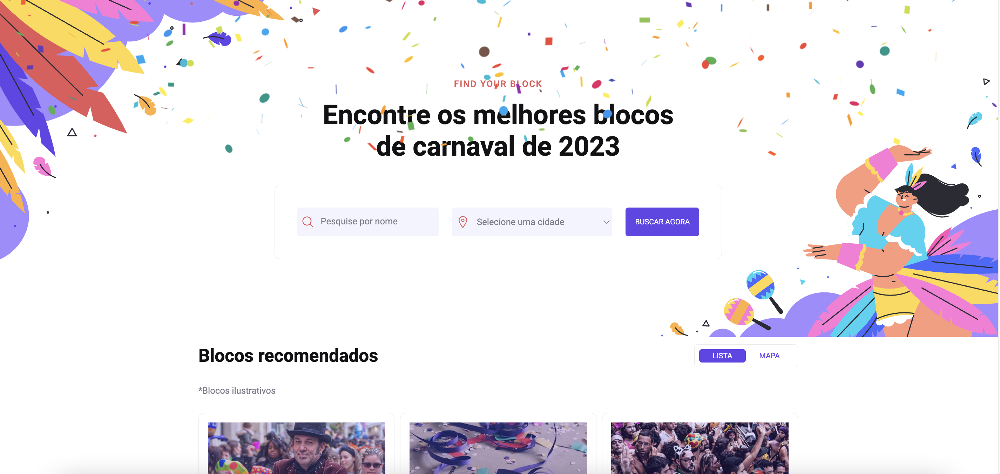

<h1 align="center"> #7 Carnaval Searcher </h1>

Um site para encontrar um bloco de carnaval é o #7 desafio <a href="https://boracodar.dev/">#BORACODAR</a> da RocketSeat 

  <a href="#-tecnologias">Tecnologias</a>&nbsp;&nbsp;&nbsp;|&nbsp;&nbsp;&nbsp;
  <a href="#-projeto">Projeto</a>&nbsp;&nbsp;&nbsp;|&nbsp;&nbsp;&nbsp;
  <a href="#-layout">Layout</a>&nbsp;&nbsp;&nbsp;|&nbsp;&nbsp;&nbsp;
  <a href="#-collaborators">Collaborators</a>&nbsp;&nbsp;&nbsp;|&nbsp;&nbsp;&nbsp;

 

  

## 🚀 Tecnologias

Esse projeto foi desenvolvido com as seguintes tecnologias:

- HTML
- CSS
- JavaScript
- React
- Git e Github
- Figma
- React Leaflet

## 💻 Projeto

O projeto _Carnaval Searcher_ foi realizado como parte do #7 desafio #BORACODAR da RocketSeat sugerido pelo professor <a href="https://github.com/maykbrito" alt="Link para o GitHub do professor Mayk Brito" target="_blank">Mayk Brito</a>.

<h1 align="center">
  Funcionalidades
</h1>

O desafio inicial foi a criação de um site para buscar blocos de carnaval como o modelo mostrado em <a href="#-layout">Layout</a>, após a confecção do modelo, adicionamos a funcionalidade de poder pesquisar pelo bloco e mostrar a localização dos blocos no mapa.

<h2 align="center">
  Página Inicial
</h2>

Na Página Inicial, há a opção de pesquisar por nome do bloco ou região em que ele se encontra.

  

Na caixa onde são mostrado os resultados da pesquisa, há um botão indicando a visualização por lista ou por mapa, caso selecionado mapa, será mostrado pins com a localização de cada bloco. Ao ser clicado, abre um popup com mais informações.

  

_<h2 align="center" ><a href="https://carnaval-searcher.vercel.app/" target="_blank">Visite o projeto online</a></h2>_

## 🔖 Layout

Você pode visualizar o layout proposto pela RocketSeat através do [LINK](https://www.figma.com/community/file/1207675804423978995). É necessário ter conta no [Figma](https://figma.com) para acessá-lo.

## 📃 Collaborators

This challange was made by [Julia](https://gsajulia.github.io) and [Ricardo](https://rickazuo.github.io/portfolio/)